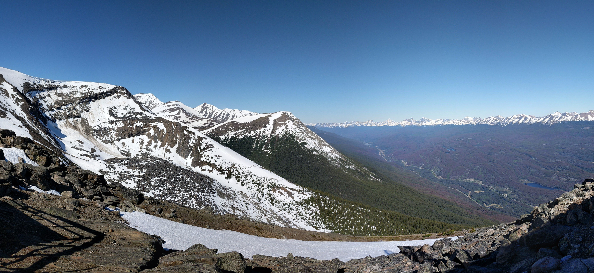

## Hey, Thanks for stopping by! 👋

## 

#### About me 👨‍💻

- 3rd year student in Computer and Electrical Engineering at McMaster University

- Currently growing and learning web development

- Interesting in learning and growing more in AI and Embedded systems development

---

#### Languages and Tools 🗣️⚙️

      

---

#### Current Pursuits 🚩

- Full Stack Web Development
- Low Code Development Tools
- Machine Learning

---

#### Other stuff 🤠

- 🎸I enjoy playing Guitar
- 🏐I like playing sports

---

#### Connect with me 🔗

